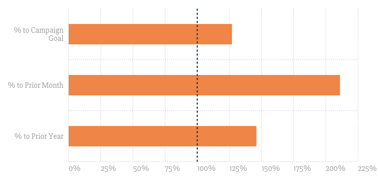

# Chartist Goal Line Demo

A simple Chartist JavaScript plugin to put goal lines on your charts. Check out the
project page too: [YorkshireInteractive/chartist-goal-line](https://github.com/YorkshireInteractive/chartist-goal-line)


## Options

- `className`: The class name so you can style the text. Default: _'ct-goal-line'_.
- `axis`: The axis to draw the line. y == vertical bars, x == horizontal. Default: _'y'_.
- `value`: What value the goal line should be drawn at

## Default usage

<div class="ct-chart"></div>

```js
var chart1 = new Chartist.Bar('.ct-chart', {
  labels: ['Feb', 'Mar', 'Apr', 'May'],
  series: [
    [19, 15, 9, 13]
  ],
  },{
  height: 400,
  axisY: {
    onlyInteger: true
  },
  plugins: [
    Chartist.plugins.ctGoalLine({
      value: 14
    })
  ]
});
```
      

## Horizontal bar usage

<div class="ct-chart-2"></div>

```js
var chart2 = new Chartist.Bar('.ct-chart-2', {
  labels: ['% to Campaign Goal', '% to Prior Month', '% to Prior Year'],
  series: [
    [127, 211, 146]
  ]
}, {
  chartPadding: {
    right: 50
  },
  height: 350,
  horizontalBars: true,
  reverseData: true,
  axisX: {
    labelInterpolationFnc: function(value) {
      return value + '%';
    },
    onlyInteger: true,
  },
  axisY: {
    offset: 135,
  },
  plugins: [
    Chartist.plugins.ctGoalLine({
      value: 100,
      axis: 'x'
    })
  ]
});
```

## Contributing

### Building

To build simply run `npm install` and then `npm run start`. That will build the
files and put them in `/build`.

#### How it works
The demo site is all built from the `src/README.md` file and the
`layouts/default.html` file. Even the repo's `README.md` file is built from the
`src/README.md` file. We use [Metalsmith](http://metalsmith.io) to build the
files and how it works is: src/README.md is parsed into HTML and then put into
the `layouts/default.html` file by replacing the `{{{ contents }}}` tag. All
other files in `/src` are moved into `/build`. It also takes the
`src/README.md` and removes the header section with the page meta data and puts
it in the top level directory for the project.

_NOTE: Metalsmith requires Node >0.12_

### Deploying

To deploy you must have push access to the remote set in your `.git` directory.
To deploy your files just run `npm run deploy`. This runs `npm install`, goes
into the build folder, removes and creates a git repo and then commits all the
files inside and force pushes to the `gh-pages` branch.
